---
## Front matter
title: "ОТЧЕТ О ВЫПОЛНЕНИИ ЛАБОРАТОРНОЙ РАБОТЫ № 3"
subtitle: "_дисциплина: Архитектура компьютера_"
author: "Шилоносов Данил Вячеславович"

## Generic otions
lang: ru-RU
toc-title: "Содержание"

## Bibliography
bibliography: bib/cite.bib
csl: pandoc/csl/gost-r-7-0-5-2008-numeric.csl

## Pdf output format
toc: true # Table of contents
toc-depth: 2
lof: true # List of figures
lot: false # List of tables
fontsize: 12pt
linestretch: 1.5
papersize: a4
documentclass: scrreprt
## I18n polyglossia
polyglossia-lang:
  name: russian
  options:
	- spelling=modern
	- babelshorthands=true
polyglossia-otherlangs:
  name: english
## I18n babel
babel-lang: russian
babel-otherlangs: english
## Fonts
mainfont: PT Serif
romanfont: PT Serif
sansfont: PT Sans
monofont: PT Mono
mainfontoptions: Ligatures=TeX
romanfontoptions: Ligatures=TeX
sansfontoptions: Ligatures=TeX,Scale=MatchLowercase
monofontoptions: Scale=MatchLowercase,Scale=0.9
## Biblatex
biblatex: true
biblio-style: "gost-numeric"
biblatexoptions:
  - parentracker=true
  - backend=biber
  - hyperref=auto
  - language=auto
  - autolang=other*
  - citestyle=gost-numeric
## Pandoc-crossref LaTeX customization
figureTitle: "Рис."
tableTitle: "Таблица"
listingTitle: "Листинг"
lofTitle: "Список иллюстраций"
lotTitle: "Список таблиц"
lolTitle: "Листинги"
## Misc options
indent: true
header-includes:
  - \usepackage{indentfirst}
  - \usepackage{float} # keep figures where there are in the text
  - \floatplacement{figure}{H} # keep figures where there are in the text
---

# Цель работы

Целью работы является изучить идеологию и применение средств контроля версий. Приобрести практические навыки по работе с системой git.

# Выполнение лабораторной работы

Лабораторная работа выполнена на ОС Ubuntu 22.04 LTS (x86_64).

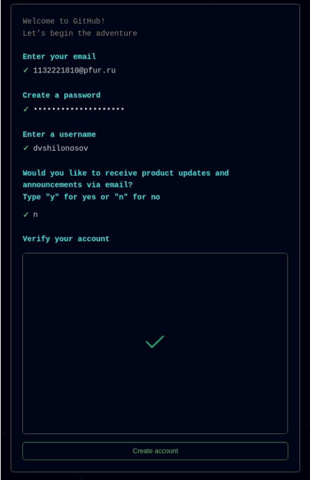{ #fig:fig1 width=70% }

{ #fig:fig2 width=70% }

В базовую настройку git (рис. [-@fig:fig3]) входит: указание имени и email владельца
репозитория (строка 1-2), настройка utf-8 в выводе сообщений git (строка 3),
задание имени начальной ветки (строка 4), настройка параметров autocrlf и safecrlf
(строка 5-6).

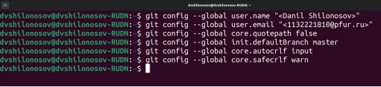{ #fig:fig3 width=70% }

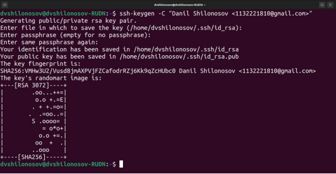{ #fig:fig4 width=70% }

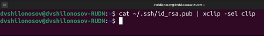{ #fig:fig5 width=70% }

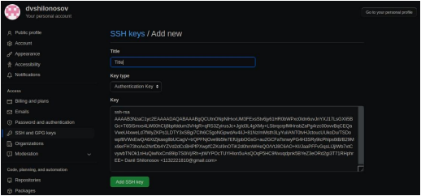{ #fig:fig6 width=70% }

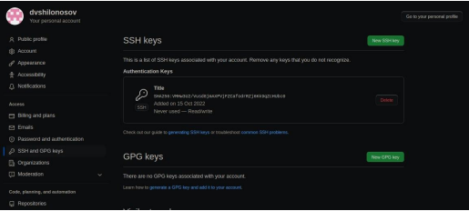{ #fig:fig7 width=70% }

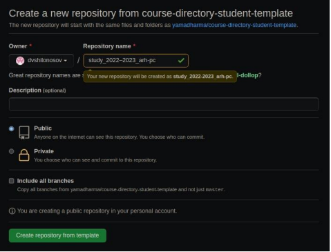{ #fig:fig9 width=70% }

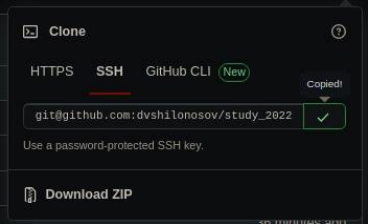{ #fig:fig10 width=70% }

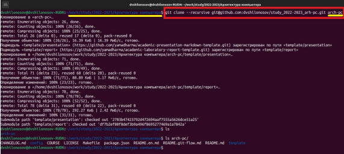{ #fig:fig11 width=70% }

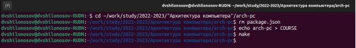{ #fig:fig12 width=70% }

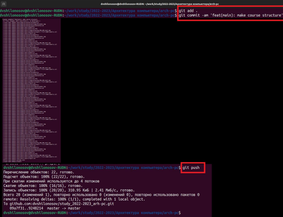{ #fig:fig13 width=70% }

# Выполнение заданий для самостоятельной работы

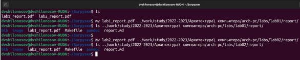{ #fig:fig14 width=70% }

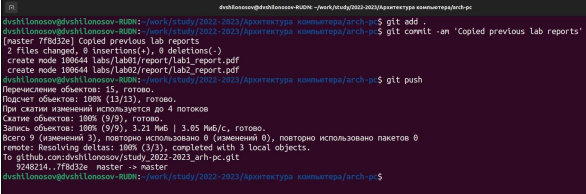{ #fig:fig15 width=70% }

# Выводы

Были изучены основные концепции идеологии применения средств контроля версий. Приобретены практические навыки по работе с системой git. Поставленные задачи выполнены.
