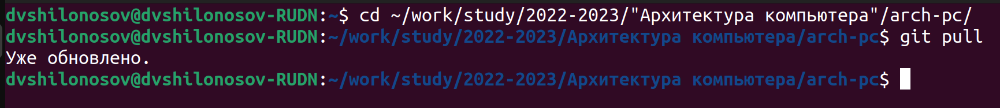
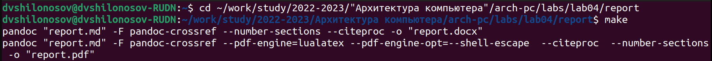
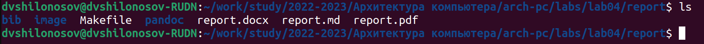
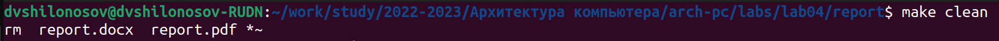
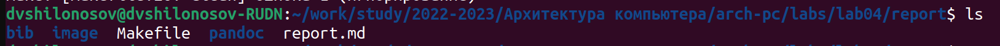
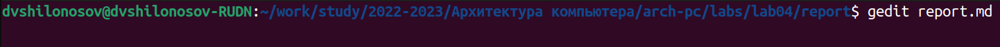
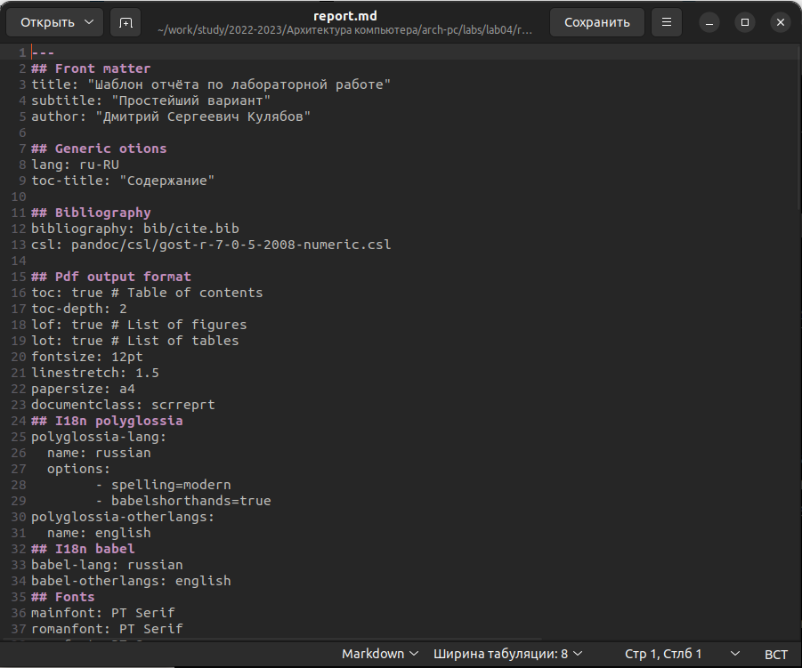
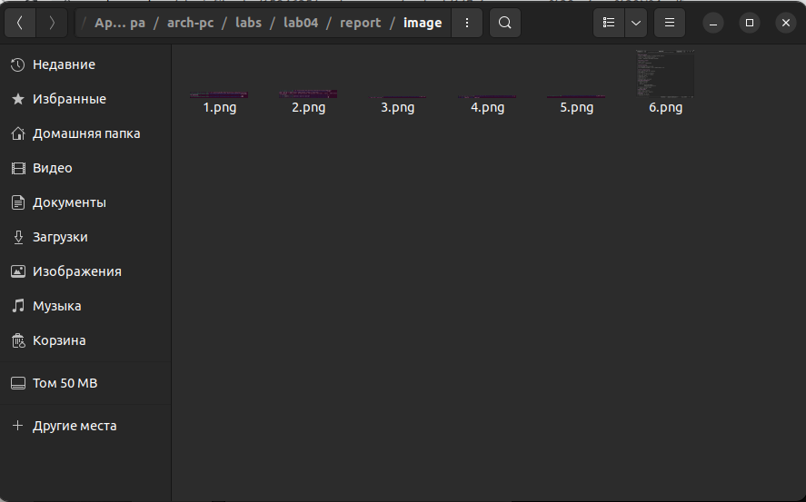
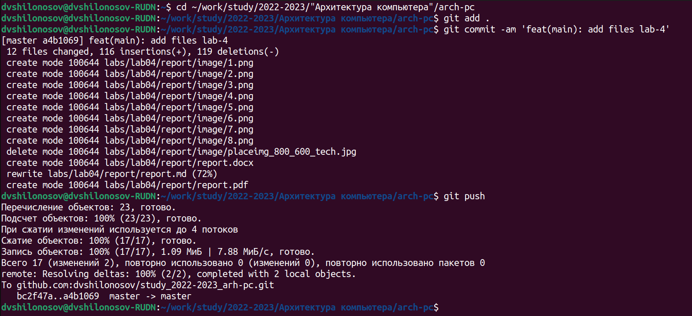

---
## Front matter
title: "ОТЧЕТ О ВЫПОЛНЕНИИ ЛАБОРАТОРНОЙ РАБОТЫ № 4"
subtitle: "_дисциплина: Архитектура компьютера_"
author: "Шилоносов Данил Вячеславович"

## Generic otions
lang: ru-RU
toc-title: "Содержание"

## Bibliography
bibliography: bib/cite.bib
csl: pandoc/csl/gost-r-7-0-5-2008-numeric.csl

## Pdf output format
toc: true # Table of contents
toc-depth: 2
lof: true # List of figures
lot: false # List of tables
fontsize: 12pt
linestretch: 1.5
papersize: a4
documentclass: scrreprt
## I18n polyglossia
polyglossia-lang:
  name: russian
  options:
	- spelling=modern
	- babelshorthands=true
polyglossia-otherlangs:
  name: english
## I18n babel
babel-lang: russian
babel-otherlangs: english
## Fonts
mainfont: PT Serif
romanfont: PT Serif
sansfont: PT Sans
monofont: PT Mono
mainfontoptions: Ligatures=TeX
romanfontoptions: Ligatures=TeX
sansfontoptions: Ligatures=TeX,Scale=MatchLowercase
monofontoptions: Scale=MatchLowercase,Scale=0.9
## Biblatex
biblatex: true
biblio-style: "gost-numeric"
biblatexoptions:
  - parentracker=true
  - backend=biber
  - hyperref=auto
  - language=auto
  - autolang=other*
  - citestyle=gost-numeric
## Pandoc-crossref LaTeX customization
figureTitle: "Рис."
tableTitle: "Таблица"
listingTitle: "Листинг"
lofTitle: "Список иллюстраций"
lotTitle: "Список таблиц"
lolTitle: "Листинги"
## Misc options
indent: true
header-includes:
  - \usepackage{indentfirst}
  - \usepackage{float} # keep figures where there are in the text
  - \floatplacement{figure}{H} # keep figures where there are in the text
---

# Цель работы

Целью работы является освоение процедуры оформления отчетов с помощью легковесного языка разметки Markdown.

# Выполнение лабораторной работы

Перейдем в каталог курса, сформированный при выполнении лабораторной работы №3, обновим локальный репозиторий, скачав изменения из удаленного репозитория. (рис. [-@fig:fig1])

{ #fig:fig1 width=70% }

Перейдем в каталог с шаблоном отчета о выполнении лабораторной работы № 4 и проведем компиляцию шаблона с использованием Makefile. Для этого введем команду make.
При успешной компиляции должны сгенерироваться файлы report.pdf и report.docx. Откроем и проверим корректность полученных файлов. (рис. [-@fig:fig2])

{ #fig:fig2 width=70% }

При успешной компиляции должны сгенерироваться файлы report.pdf и report.docx. Откроем и проверим корректность полученных файлов. (рис. [-@fig:fig3])

{ #fig:fig3 width=70% }

Удалим полученные файлы с использованием Makefile. Для этого введем команду  make clean. (рис. [-@fig:fig4])

{ #fig:fig4 width=70% }

Проверим, что после этой команды файлы report.pdf и report.docx были удалены. (рис. [-@fig:fig5])

{ #fig:fig5 width=70% }

Откроем файл report.md c помощью текстового редактора gedit. (рис. [-@fig:fig6], [-@fig:fig7])

{ #fig:fig6 width=70% }

{ #fig:fig7 width=70% }

Для корректного отображения скриншотов разместим их в каталоге image. (рис. [-@fig:fig8])

{ #fig:fig8 width=70% }

Загрузим файлы на Github. (рис. [-@fig:fig9])

{ #fig:fig9 width=70% }

# Выполнение задания для самостоятельной работы

# Выводы

В процессе выполнения лабораторной работы были получены практические навыки оформления отчетов с помощью легковесного языка разметки Markdown.
