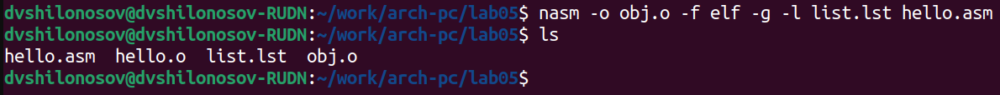

---
## Front matter
title: "ОТЧЕТ О ВЫПОЛНЕНИИ ЛАБОРАТОРНОЙ РАБОТЫ №5"
subtitle: "_дисциплина: Архитектура компьютера_"
author: "Шилоносов Данил Вячеславович"

## Generic otions
lang: ru-RU
toc-title: "Содержание"

## Bibliography
bibliography: bib/cite.bib
csl: pandoc/csl/gost-r-7-0-5-2008-numeric.csl

## Pdf output format
toc: true # Table of contents
toc-depth: 2
lof: true # List of figures
lot: false # List of tables
fontsize: 12pt
linestretch: 1.5
papersize: a4
documentclass: scrreprt
## I18n polyglossia
polyglossia-lang:
  name: russian
  options:
	- spelling=modern
	- babelshorthands=true
polyglossia-otherlangs:
  name: english
## I18n babel
babel-lang: russian
babel-otherlangs: english
## Fonts
mainfont: PT Serif
romanfont: PT Serif
sansfont: PT Sans
monofont: PT Mono
mainfontoptions: Ligatures=TeX
romanfontoptions: Ligatures=TeX
sansfontoptions: Ligatures=TeX,Scale=MatchLowercase
monofontoptions: Scale=MatchLowercase,Scale=0.9
## Biblatex
biblatex: true
biblio-style: "gost-numeric"
biblatexoptions:
  - parentracker=true
  - backend=biber
  - hyperref=auto
  - language=auto
  - autolang=other*
  - citestyle=gost-numeric
## Pandoc-crossref LaTeX customization
figureTitle: "Рис."
tableTitle: "Таблица"
listingTitle: "Листинг"
lofTitle: "Список иллюстраций"
lotTitle: "Список таблиц"
lolTitle: "Листинги"
## Misc options
indent: true
header-includes:
  - \usepackage{indentfirst}
  - \usepackage{float} # keep figures where there are in the text
  - \floatplacement{figure}{H} # keep figures where there are in the text
---

# Цель работы

Освоение процедуры компиляции и сборки программ, написанных на ассемблере NASM.

# Выполнение лабораторной работы

Создадим каталог для работы с программами на языке ассемблера NASM и перейдем в него. (рис. [-@fig:fig1])

{ #fig:fig1 width=70% }

Создадим текстовый файл с именем hello.asm и откроем его с помощью текстового редактора gedit. (рис. [-@fig:fig2], [-@fig:fig3])

{ #fig:fig2 width=70% }

{ #fig:fig3 width=70% }

Сгенерируем объектный файл исходного текста программы hello.asm. (рис. [-@fig:fig4])

{ #fig:fig4 width=70% }

Имя объектного файла - hello.o - такое же, как и у исходного текстового файла с кодом ассемблера.

Выполним команду, которая скомпилирует исходный файл hello.asm в obj.o, при этом формат выходного файла будет elf, и в него будут включены символы для отладки (опция -g), кроме того, будет создан файл листинга list.lst (опция-l). (рис. [-@fig:fig5])

{ #fig:fig5 width=70% }

Передадим файл на обработку компоновщику, чтобы получить исполняемую программу. (рис. [-@fig:fig6])

{ #fig:fig6 width=70% }

Сгенерируем исполняемую программу с помощью объектного файла obj.o, имеющего отличное от исходного текста программы hello.asm название, и дадим программе имя main. (рис. [-@fig:fig7])

{ #fig:fig7 width=70% }

Т.о. имя исполняемого файла - main, а имя объектного файла, из которого собран исполняемый файл, - obj.o.

Запустим на выполнение созданный исполняемый файл, находящийся в текущем каталоге. (рис. [-@fig:fig8])

{ #fig:fig8 width=70% }

# Выполнение задания для самостоятельной работы

В каталоге ~/work/arch-pc/lab05 с помощью команды cp создадим копию файла hello.asm с именем lab5.asm (рис. [-@fig:fig9])

{ #fig:fig9 width=70% }

С помощью текстового редактора gedit внесем изменения в текст программы в файле lab5.asm так, чтобы вместо Hello world! на экран выводились имя и фамилия студента, выполняющего отчет. (рис. [-@fig:fi10], [-@fig:fi11])

{ #fig:fig10 width=70% }

{ #fig:fig11 width=70% }

Оттранслируем полученный текст программы lab5.asm в объектный файл. Выполним компоновку объектного файла и запустим получившийся исполняемый файл. (рис. [-@fig:fig12])

{ #fig:fig12 width=70% }

Скопируем файлы hello.asm и lab5.asm в локальный репозиторий в каталог ~/work/study/2022-2023/"Архитектура компьютера"/archpc/labs/lab05/. (рис. [-@fig:fig13])

{ #fig:fig13 width=70% }

# Выводы

В процессе выполнения лабораторной работы были полученые практические навыки, освоены процедуры компиляции и сборки программ, написанных на ассемблере NASM.
