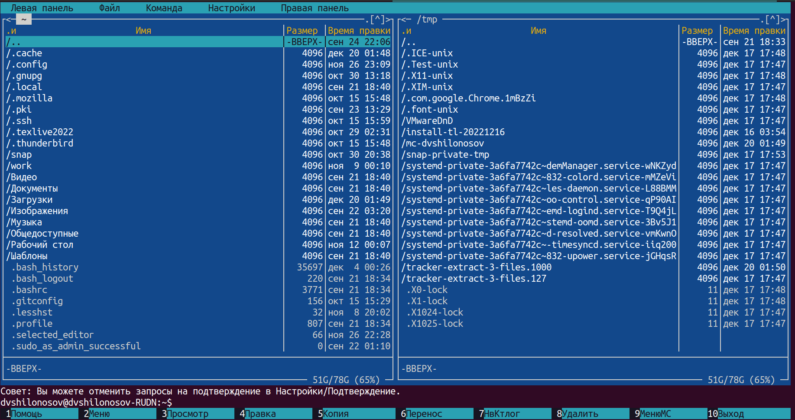
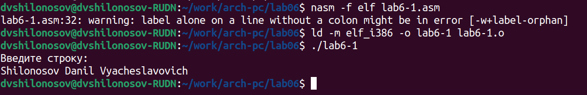

---
## Front matter
title: "ОТЧЕТ О ВЫПОЛНЕНИИ ЛАБОРАТОРНОЙ РАБОТЫ №6"
subtitle: "_дисциплина: Архитектура компьютера_"
author: "Шилоносов Данил Вячеславович"

## Generic otions
lang: ru-RU
toc-title: "Содержание"

## Bibliography
bibliography: bib/cite.bib
csl: pandoc/csl/gost-r-7-0-5-2008-numeric.csl

## Pdf output format
toc: true # Table of contents
toc-depth: 2
lof: true # List of figures
lot: false # List of tables
fontsize: 12pt
linestretch: 1.5
papersize: a4
documentclass: scrreprt
## I18n polyglossia
polyglossia-lang:
  name: russian
  options:
	- spelling=modern
	- babelshorthands=true
polyglossia-otherlangs:
  name: english
## I18n babel
babel-lang: russian
babel-otherlangs: english
## Fonts
mainfont: PT Serif
romanfont: PT Serif
sansfont: PT Sans
monofont: PT Mono
mainfontoptions: Ligatures=TeX
romanfontoptions: Ligatures=TeX
sansfontoptions: Ligatures=TeX,Scale=MatchLowercase
monofontoptions: Scale=MatchLowercase,Scale=0.9
## Biblatex
biblatex: true
biblio-style: "gost-numeric"
biblatexoptions:
  - parentracker=true
  - backend=biber
  - hyperref=auto
  - language=auto
  - autolang=other*
  - citestyle=gost-numeric
## Pandoc-crossref LaTeX customization
figureTitle: "Рис."
tableTitle: "Таблица"
listingTitle: "Листинг"
lofTitle: "Список иллюстраций"
lotTitle: "Список таблиц"
lolTitle: "Листинги"
## Misc options
indent: true
header-includes:
  - \usepackage{indentfirst}
  - \usepackage{float} # keep figures where there are in the text
  - \floatplacement{figure}{H} # keep figures where there are in the text
---

# Цель работы

Приобретение практических навыков работы в Midnight Commander. Освоение инструкций языка ассемблера mov и int.

# Выполнение лабораторной работы

Откроем Midnight Commander. (рис. [-@fig:fig1], [-@fig:fig2])

{ #fig:fig1 width=70% }

{ #fig:fig2 width=70% }

Пользуясь клавишами "стрелка вверх", "стрелка вниз" и "Enter" перейдем в каталог ~/work/arch-pc, созданный при выполнении лабораторной работы №5. (рис. [-@fig:fig3])

{ #fig:fig3 width=70% }

С помощью функциональной клавиши F7 создадим папку lab06 и перейдем в созданный каталог (рис. [-@fig:fig4], [-@fig:fig5], [-@fig:fig6]).

{ #fig:fig4 width=70% }

{ #fig:fig5 width=70% }

{ #fig:fig6 width=70% }

Пользуясь строкой ввода и командой touch создадим файл lab6-1.asm. (рис. [-@fig:fig7], [-@fig:fig8])

{ #fig:fig7 width=70% }

{ #fig:fig8 width=70% }

С помощью функциональной клавиши F4 откроем файл lab6-1.asm для редактирования во встроенном редакторе (рис. [-@fig:fig9])

{ #fig:fig9 width=70% }

Введем текст программы из листинга 6.1, сохраним изменения и закроем файл. (рис. [-@fig:fig10])

{ #fig:fig10 width=70% }

С помощью функциональной клавиши F3 откроем файл lab6-1.asm для просмотра. Убедимся, что файл содержит текст программы. (рис. [-@fig:fig11])

{ #fig:fig11 width=70% }

Оттранслируем текст программы lab6-1.asm в объектный файл. Выполним компоновку объектного файла и запустим получившийся исполняемый файл. Программа выводит строку 'Введите строку:' и ожидает ввода с клавиатуры. На запрос введем ФИО студента, которым выполнена лабораторная работа. (рис. [-@fig:fig12])

{ #fig:fig12 width=70% }

Скачаем файл in_out.asm со страницы курса в ТУИС. (рис. [-@fig:fig13])

{ #fig:fig13 width=70% }

Подключаемый файл in_out.asm должен лежать в том же каталоге, что и файл с программой, в которой он используется. (рис. [-@fig:fig14], [-@fig:fig15])

{ #fig:fig14 width=70% }

{ #fig:fig15 width=70% }

С помощью функциональной клавиши F6 создадим копию файла lab6-1.asm с именем lab6-2.asm. (рис. [-@fig:fig16], [-@fig:fig17])

{ #fig:fig16 width=70% }

{ #fig:fig17 width=70% }

Исправим текст программы в файле lab6-2.asm с использование подпрограмм из внешнего файла in_out.asm (используем подпрограммы sprintLF, sread и quit) в соответствии с листингом 6.2. Создадим исполняемый файл и проверим его работу. (рис. [-@fig:fig18], [-@fig:fig19])

{ #fig:fig18 width=70% }

{ #fig:fig19 width=70% }

В файле lab6-2.asm заменим подпрограмму sprintLF на sprint. Создадим исполняемый файл и проверим его работу. Можно заметить разницу в том, что первая функция в отличие от второй после вывода строки "Введите строку: " переводит курсор на новую строку. (рис. [-@fig:fig20], [-@fig:fig21])

{ #fig:fig20 width=70% }

{ #fig:fig21 width=70% }

# Выполнение заданий для самостоятельной работы

Создадим копию файла lab6-1.asm. Внесем изменения в программу (без использования внешнего файла in_out.asm), так, чтобы она работала по следующему алгоритму:
	• вывести приглашение типа “Введите строку:”;
	• ввести строку с клавиатуры;
	• вывести введённую строку на экран. (рис. [-@fig:fig22], [-@fig:fig23], [-@fig:fig24])

{ #fig:fig22 width=70% }

{ #fig:fig23 width=70% }

{ #fig:fig24 width=70% }

Получим исполняемый файл и проверим его работу. На приглашение ввести строку введем ФИО студента, которым выполнена лабораторная работа. (рис. [-@fig:fig25])

{ #fig:fig25 width=70% }

Создадим копию файла lab6-2.asm. Исправим текст программы с использованием подпрограмм из внешнего файла in_out.asm, так чтобы она работала по следующему алгоритму:
	• вывести приглашение типа “Введите строку:”;
	• ввести строку с клавиатуры;
	• вывести введённую строку на экран. (рис. [-@fig:fig26], [-@fig:fig27], [-@fig:fig28])

{ #fig:fig26 width=70% }

{ #fig:fig27 width=70% }

{ #fig:fig28 width=70% }

Создадим исполняемый файл и проверим его работу. (рис. [-@fig:fig29])

{ #fig:fig29 width=70% }

# Выводы

В процессе выполнения лабораторной работы были приобретены практичекие навыки работы в Midnight Commander, освоены инструкции языка ассемблера mov и int.
