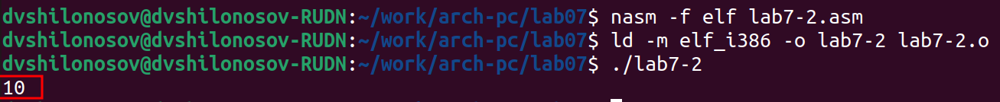

---
## Front matter
title: "ОТЧЕТ О ВЫПОЛНЕНИИ ЛАБОРАТОРНОЙ РАБОТЫ №7"
subtitle: "_дисциплина: Архитектура компьютера_"
author: "Шилоносов Данил Вячеславович"

## Generic otions
lang: ru-RU
toc-title: "Содержание"

## Bibliography
bibliography: bib/cite.bib
csl: pandoc/csl/gost-r-7-0-5-2008-numeric.csl

## Pdf output format
toc: true # Table of contents
toc-depth: 2
lof: true # List of figures
lot: false # List of tables
fontsize: 12pt
linestretch: 1.5
papersize: a4
documentclass: scrreprt
## I18n polyglossia
polyglossia-lang:
  name: russian
  options:
	- spelling=modern
	- babelshorthands=true
polyglossia-otherlangs:
  name: english
## I18n babel
babel-lang: russian
babel-otherlangs: english
## Fonts
mainfont: PT Serif
romanfont: PT Serif
sansfont: PT Sans
monofont: PT Mono
mainfontoptions: Ligatures=TeX
romanfontoptions: Ligatures=TeX
sansfontoptions: Ligatures=TeX,Scale=MatchLowercase
monofontoptions: Scale=MatchLowercase,Scale=0.9
## Biblatex
biblatex: true
biblio-style: "gost-numeric"
biblatexoptions:
  - parentracker=true
  - backend=biber
  - hyperref=auto
  - language=auto
  - autolang=other*
  - citestyle=gost-numeric
## Pandoc-crossref LaTeX customization
figureTitle: "Рис."
tableTitle: "Таблица"
listingTitle: "Листинг"
lofTitle: "Список иллюстраций"
lotTitle: "Список таблиц"
lolTitle: "Листинги"
## Misc options
indent: true
header-includes:
  - \usepackage{indentfirst}
  - \usepackage{float} # keep figures where there are in the text
  - \floatplacement{figure}{H} # keep figures where there are in the text
---

# Цель работы

Освоение арифметических инструкций языка ассемблера NASM.

# Выполнение лабораторной работы

Создадим каталог для программ лабораторной работы №7, перейдем в нее и создадим файл lab7-1.asm. (рис. [-@fig:fig1])

{ #fig:fig1 width=70% }

Рассмотрим примеры программ вывода символьных и численных значений.
Введем в файл lab7-1.asm текст программы из листинга 7.1. (рис. [-@fig:fig2])

{ #fig:fig2 width=70% }

Для корректной работы программы подключаемый файл in_out.asm должен лежать в том же каталоге, что и файл с текстом программы. Перед созданием исполняемого файла создадим копию файла in_out.asm в каталоге ~/work/arch-pc/lab07. (рис. [-@fig:fig3], [-@fig:fig4])

{ #fig:fig3 width=70% }

{ #fig:fig4 width=70% }

В данной программе в регистр eax записывается символ 6 (mov eax, '6'), в регистр ebx символ 4 (mov ebx, '4'). Далее к значению в регистре eax прибавляем значение регистра ebx (add eax, ebx, результат сложения запишется в регистр eax). Далее выводим результат. Так как для работы функции sprintLF в регистр eax должен быть записан адрес, необходимо использовать дополнительную переменную. Для этого запишем значение регистра eax в переменную buf1 (mov [buf1], eax), а затем запишем адрес переменной buf1 в регистр eax (mov eax, buf1) и вызовем функцию sprintLF.

Создадим исполняемый файл текста lab7-1.asm и запустим его. (рис. [-@fig:fig5])

{ #fig:fig5 width=70% }

В данном случае при выводе значения регистра eax мы ожидаем увидеть число 10. Однако результатом будет символ j. Это происходит потому, что код символа 6 равен 00110110 в двоичном представлении (или 54 в десятичном представлении), а код символа 4 – 00110100 (52). Команда add eax, ebx запишет в регистр eax сумму кодов – 01101010 (106), что в свою очередь является кодом символа j (см. таблицу ASCII в приложении).

Далее изменим текст программы и вместо символов запишем в регистры числа. (рис. [-@fig:fig6])

{ #fig:fig6 width=70% }

Создадим исполняемый файл и запустим его. (рис. [-@fig:fig7])

{ #fig:fig7 width=70% }

Как и в предыдущем случае при исполнении программы мы не получим число 10. Пользуясь таблицей ASCII, определим, что символу '8' соответствует код 10 (nl). Этот символ не отображается на экране, потому что он соответствует переходу курсора на новую строку (nl - "next line"). 

Для работы с числами в файле in_out.asm реализованы подпрограммы для преобразования ASCII-символов в числа и обратно. Преобразуем текст программы из Листинга 7.1 с использованием этих функций.

Создадим файл lab7-2.asm в каталоге ~/work/arch-pc/lab07 и введем в него текст программы из листинга 7.2. (рис. [-@fig:fig8], [-@fig:fig9])

{ #fig:fig8 width=70% }

{ #fig:fig9 width=70% }

Создадим исполняемый файл и запустим его. (рис. [-@fig:fig10])

{ #fig:fig10 width=70% }

В результате работы программы мы получим число 106. В данном случае, как и в первом, команда add складывает коды символов ‘6’ и ‘4’ (54+52=106). Однако, в отличие от программы из листинга 7.1, функция iprintLF позволяет вывести число, а не символ, кодом которого является это число.

Аналогично предыдущему примеру изменим символы на числа. (рис. [-@fig:fig11])

{ #fig:fig11 width=70% }

Создадим исполняемый файл и запустим его. (рис. [-@fig:fig12])

{ #fig:fig12 width=70% }

Результат: на экране выведено число 10.

Заменим функцию iprintLF на iprint. (рис. [-@fig:fig13])

{ #fig:fig13 width=70% }

Создадим исполняемый файл текста lab7-2.asm и запустим его. (рис. [-@fig:fig14])

{ #fig:fig14 width=70% }

Результат: на экране выведено число 10 без символа перехода на новую строку.

Вывод функций iprintLF и iprint отличается тем, что первая из них, в отличие от второй, после вывода содержимого на экран переводит курсор на новую строку.

В качестве примера выполнения арифметических операций в NASM приведем программу вычисления арифметического выражения f(x) = (5 * 2 + 3) / 3.

Создадим файл lab7-3.asm в каталоге ~/work/arch-pc/lab07. (рис. [-@fig:fig15])

{ #fig:fig15 width=70% }

Внимательно изучим текст программы из листинга 7.3 и введем в lab7-3.asm. (рис. [-@fig:fig16])

{ #fig:fig16 width=70% }

Создадим исполняемый файл и запустим его. (рис. [-@fig:fig17])

{ #fig:fig17 width=70% }

Изменим текст программы для вычисления выражения f(x) = (4 * 6 + 2) / 5. Создадим исполняемый файл и проверим его работу. (рис. [-@fig:fig18], [-@fig:fig19])

{ #fig:fig18 width=70% }

{ #fig:fig19 width=70% }

В качестве другого примера рассмотрим программу вычисления варианта задания по номеру студенческого билета, работающую по следующему алгоритму:

- вывести запрос на введение No студенческого билета;

- вычислить номер варианта по формуле: (Sn mod 20) + 1, где Sn – номер студенческого билета (В данном случае a mod b – это остаток от деления a на b);

- вывести на экран номер варианта.

В данном случае число, над которым необходимо проводить арифметические операции, вводится с клавиатуры. Как отмечалось выше ввод с клавиатуры осуществляется в символьном виде и для корректной работы арифметических операций в NASM символы необходимо преобразовать в числа. Для этого может быть использована функция atoi из файла in_out.asm.

Создадим файл variant.asm в каталоге ~/work/arch-pc/lab07. (рис. [-@fig:fig20], [-@fig:fig21])

{ #fig:fig20 width=70% }

{ #fig:fig21 width=70% }

Создадим исполняемый файл и запустим его. (рис. [-@fig:fig22])

{ #fig:fig22 width=70% }

Проверим результат работы программы, вычислив номер варианта аналитически:
(1132221810 % 20) + 1 = 10 + 1 = 11. Вариант по номеру студенческого билета вычислен верно.

# Ответы на вопросы

1. Q: Какие строки листинга 7.4 отвечают за вывод на экран сообщения "Ваш вариант:"?

A: Строки "rem: DB 'Ваш вариант: ',0", "mov eax, rem" и "call sprint" отвечают за вывод на экран сообщения ‘Ваш вариант:’. (рис. [-@fig:fig23])

{ #fig:fig23 width=70% }

2. Q: Для чего используется следующие инструкции nasm? 

- mov ecx, x

- mov edx, 80 

- call sread

A: 
1) Инструкция mov ecx, x используется для передачи регистру ecx значение из переменной неинициализированной памяти x.
2) Инструкция mov edx, 80 используется для передачи регистру edx значение 80 непосредственно.
3) Инструкция call sread используется для ввода сообщения с клавиатуры.

3. Q: Для чего используется инструкция “call atoi”?

A: Функция atoi используется для преобразовании ASCII-кода символа в целое число.

4. Q: Какие строки листинга 7.4 отвечают за вычисления варианта?

A: Строки "xor edx, edx", "mov ebx, 20", "div ebx", "inc edx" отвечают за вычисление варианта. (рис. [-@fig:fig24])

{ #fig:fig24 width=70% }

5. Q: В какой регистр записывается остаток от деления при выполнении инструкции “div ebx”?

A: Остаток от деления при выполнении инструкции “div ebx” записывается в регистр EDX.

6. Q: Для чего используется инструкция “inc edx”?

A: Инструкция “inc edx” используется для того, чтобы инкрементировать (увеличить на едиинцу) значение, хранящееся в регистре EDX.

7. Q: Какие строки листинга 7.4 отвечают за вывод на экран результата вычислений? (рис. [-@fig:fig25])

A: Строки "mov eax,rem", "call sprint", "mov eax,edx", "call iprintLF" отвечают за вывод на экран результата вычислений.

{ #fig:fig25 width=70% }

# Выполнение задания для самостоятельной работы

Напишем программу вычисления выражения y = f(x). Программа должна выводить выражение для вычисления, выводить запрос на ввод значения x, вычислять заданное выражение в зависимости от введенного x, выводить результат вычислений. (рис. [-@fig:fig26])

{ #fig:fig26 width=70% }

* При выполнении задания преобразовывать (упрощать) выражения для f(x) нельзя. При выполнении деления в качестве результата можно использовать только целую часть от деления и не учитывать остаток (т.е. 5 : 2 = 2).

Создадим файл task7-1.asm в каталоге ~/work/arch-pc/lab07. (рис. [-@fig:fig27])

{ #fig:fig27 width=70% }

Отредактируем файл task7-1.asm. (рис. [-@fig:fig28])

{ #fig:fig28 width=70% }

Создадим исполняемый файл и проверим его работу для значений x1 = 1 и x2 = 7. (рис. [-@fig:fig29])

{ #fig:fig29 width=70% }

# Выводы

В процессе выполнения лабораторной работы были приобретены практичекие навыки работы с арифметическими инструкциями языка ассемблера NASM.
